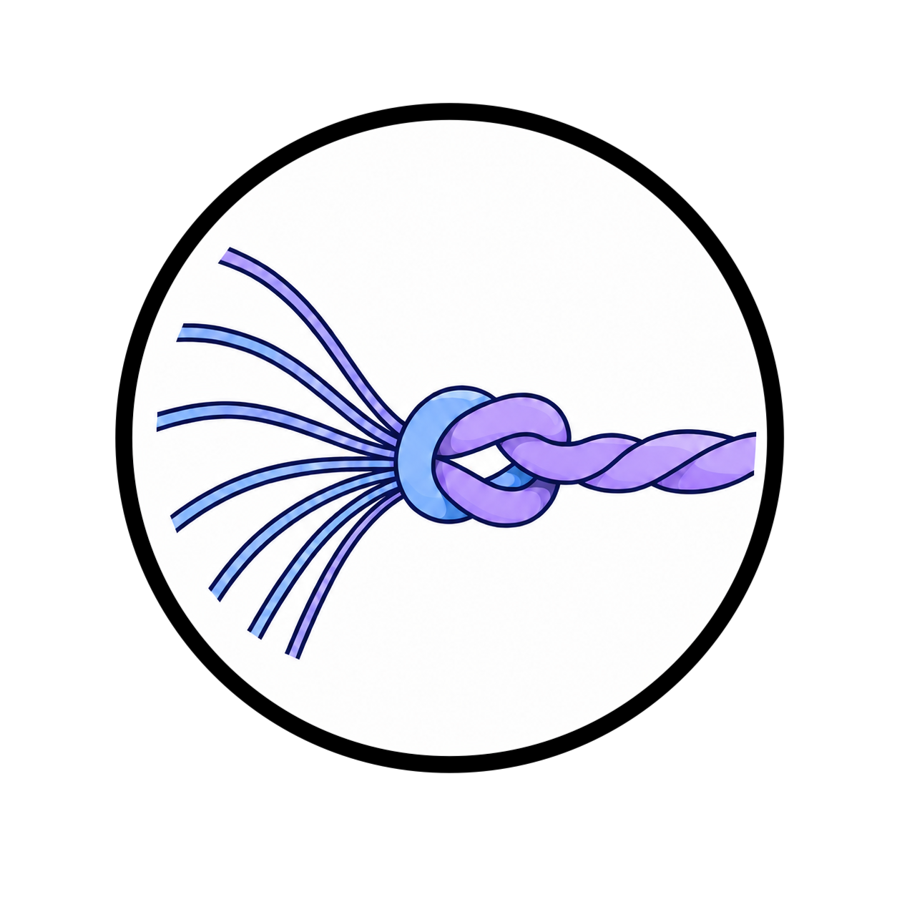

<p align="center">
  
</p>

# SMC Speculative Decoding

This repository implements **Sequential Monte Carlo Speculative Decoding (SMC-SD)** on top of [vllm](https://github.com/vllm-project/vllm). SMC-SD is a population-based alternative to rejection-based speculative decoding: N particles maintain parallel generation paths, weighted by target/draft likelihood ratios, and resampled when effective sample size drops. All drafted tokens are accepted (no rejection), and throughput scales with batch size by increasing arithmetic intensity toward the GPU compute bound.

Paper: [*Faster LLM Inference via Sequential Monte Carlo*](https://arxiv.org/abs/2604.15672)

Blog posts:
- [SMC-SD Engine v0.1.0](https://abdelfattah-lab.github.io/blogs/smcsd-engine-v0-1-0/)
- [SMC-SD Engine v0.2.0](https://abdelfattah-lab.github.io/blogs/smcsd-engine-v0-2-0/)


## Installation

This repo vendors a patched SGLang as a git submodule at `3rdparty/sglang`.

- **`main`** — pins SGLang at `smc_v2_clean-upstream-sync-2` (`smc_v2_clean` + latest `upstream/main` merged in). Requires **CUDA 13**, `torch==2.11.0`, and `sglang-kernel==0.4.2` (formerly `sgl-kernel`; same import path, new pip name).
- **`upstream`** — development/tracking branch for the same `smc_v2_clean-upstream-sync-2` snapshot.

For a CUDA 12 / `torch ~2.9` build, point the submodule at the older `smc_v2_clean` snapshot instead (`git -C 3rdparty/sglang checkout smc_v2_clean`).

**Host requirements:** CUDA 13 toolkit installed (provides `libnvrtc.so.13`). On CUDA 12 systems the prebuilt `sglang-kernel` wheel will fail to load with an undefined-symbol or `libnvrtc.so.13: cannot open shared object file` error. The Python deps (`torch==2.11.0`, `sglang-kernel==0.4.2`) are pinned by the SGLang submodule's `pyproject.toml` and will be resolved automatically.

A vllm backend is also available on the `vllm-backend` branch, which vendors a patched vllm as a git submodule at `3rdparty/vllm` (branch `vllm-smc` cut from vllm release branch `releases/v0.20.0`). Install both in editable mode.


```bash
# 1. Clone with submodules — pick the branch you want
git clone --recurse-submodules --branch main     https://github.com/abdelfattah-lab/smcsd.git
# OR for the latest upstream-merged build (needs CUDA 13):
# git clone --recurse-submodules --branch upstream https://github.com/abdelfattah-lab/smcsd.git
cd smcsd

# If you already cloned without --recurse-submodules, initialise now:
# git submodule update --init --recursive

# 2. Create a Python 3.12 environment
uv venv --python 3.12
source .venv/bin/activate

# 3. Install the patched vllm from source in editable mode using prebuilt wheels
VLLM_USE_PRECOMPILED=1 uv pip install -e 3rdparty/vllm --torch-backend=auto

# 4. Install smc from source in editable mode
uv pip install -e .
```

## Quick Start

### Smoke test 

```bash
python scripts/smc_vllm_engine.py
```

### GSM8K accuracy — SMC vLLM engine

```bash
python scripts/accuracy_test_gsm8k_vllm.py \
    --model meta-llama/Llama-3.1-8B-Instruct \
    --draft-model meta-llama/Llama-3.2-1B-Instruct \
    --particles 1 \
    --gamma 4 \
    --temperature 0.0 \
    --num-questions 200 \
    --max-tokens 512 \
    --batch-size 1 \
    --max-model-len 2048 \
    --gpu-mem 0.5
```

### GSM8K accuracy — plain vLLM baseline 

```bash
python scripts/accuracy_test_gsm8k_vllm_baseline.py \
    --draft-model meta-llama/Llama-3.1-8B-Instruct \
    --temperature 0.0 \
    --num-questions 200 \
    --max-tokens 512 \
    --batch-size 1 \
    --max-model-len 2048 \
    --gpu-mem 0.5
```

### SMC Draft vs Plain vllm engine
```bash
python scripts/compare_smc_vs_draft.py
```

## SMC-SD Parameters

| Parameter | Flag | Description |
| --- | --- | --- |
| Particles (N) | `--smc-n-particles` | Number of parallel generation paths per request |
| Gamma (K) | `--smc-gamma` | Draft tokens per speculative step |
| Draft temp | `--smc-draft-temperature` | Sampling temperature for draft model |
| Target temp | `--smc-target-temperature` | Scoring temperature for target model |
| Resample threshold | `--smc-resample-threshold` | Resample when ESS < N × threshold (0 = disable) |

## Architecture

SMC lives in the top-level `smcsd/` package. The SGLang backend is layered over patched SGLang extension points; the vLLM backend is layered over an in-process vLLM `EngineCore` with an SMC scheduler and GPU model runner.

| Path | Description |
| --- | --- |
| `smcsd/engine.py` | `SMCEngine` — standalone offline SGLang-backed engine |
| `smcsd/core/scheduler.py` | `SMCScheduler` + `SMCCoordinator` — slot-based decode loop and resampler |
| `smcsd/core/worker.py` | `SMCWorker` — draft AR loop + target scoring + importance weights |
| `smcsd/vllm_backend/engine.py` | `SMCVLLMEngine` — offline vLLM-backed SMC engine |
| `smcsd/vllm_backend/scheduler.py` | `SMCVLLMScheduler` — particle-group scheduling and KV block ownership |
| `smcsd/vllm_backend/model_runner.py` | `SMCGPUModelRunner` — draft model, target scoring, and resampling on vLLM |

See [docs/smc/architecture.md](docs/smc/architecture.md) and [docs/smc/vllm_architecture.md](docs/smc/vllm_architecture.md) for detailed design overviews.

## Citation

```bibtex
@misc{smcsd2026,
  title         = {Faster LLM Inference via Sequential Monte Carlo},
  author        = {Emara, Yahya and Barba da Costa, Mauricio and Chang, Chi-Chih
                   and Freer, Cameron and Vieira, Tim and Cotterell, Ryan
                   and Abdelfattah, Mohamed S.},
  year          = {2026},
  eprint        = {2604.15672},
  archivePrefix = {arXiv},
  primaryClass  = {cs.LG},
  url           = {https://arxiv.org/abs/2604.15672},
}
```
