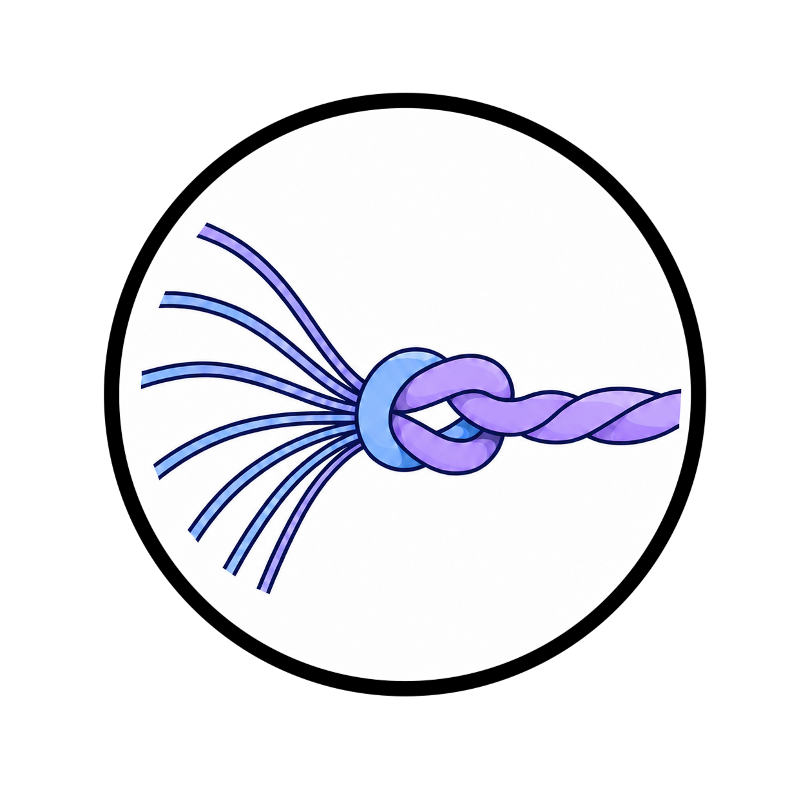

<p align="center">
  
</p>

# SMC Speculative Decoding

> **Warning:** This repository is under active development. APIs, configuration flags, and internal interfaces may go through breaking changes.

This repository implements **Sequential Monte Carlo Speculative Decoding (SMC-SD)** on top of [SGLang](https://github.com/sgl-project/sglang). SMC-SD is a population-based alternative to rejection-based speculative decoding: N particles maintain parallel generation paths, weighted by target/draft likelihood ratios, and resampled when effective sample size drops. All drafted tokens are accepted (no rejection), and throughput scales with batch size by increasing arithmetic intensity toward the GPU compute bound.

Paper: [*Faster LLM Inference via Sequential Monte Carlo*](https://arxiv.org/abs/2604.15672)

Blog posts:
- [SMC-SD Engine v0.1.0](https://abdelfattah-lab.github.io/blogs/smcsd-engine-v0-1-0/)
- [SMC-SD Engine v0.2.0](https://abdelfattah-lab.github.io/blogs/smcsd-engine-v0-2-0/)


## Installation

This repo vendors **pristine upstream SGLang** (`sgl-project/sglang@v0.5.17`) as a
git submodule at `3rdparty/sglang`, plus the SMC core hooks as git patches under
`patches/`.  `scripts/apply_sglang_patches.sh` applies them onto the submodule as
a local commit — no SGLang fork is required.  Re-run it after every
`git submodule update` (updating resets the submodule to the pristine pin);
re-running is a no-op, and `--reverse` removes the patches again.

**Host requirements:** CUDA 13 toolkit installed (provides `libnvrtc.so.13`), a
Rust toolchain (`rustup`, for the sglang grpc extension), and `protobuf-compiler`
(`protoc`).  On CUDA 12 systems the prebuilt `sglang-kernel` wheel fails to load
with a `libnvrtc.so.13: cannot open shared object file` error.  The Python deps
(`torch==2.11.0`, `flashinfer_python==0.6.15.post1`, `transformers==5.12.1`) are
pinned by the SGLang submodule's `pyproject.toml` and resolve automatically.

`SMCEngine` will not import until the patched SGLang submodule is checked out,
patched, and installed.  If you hit `ModuleNotFoundError: No module named
'sglang'`, run:

```bash
git submodule update --init --recursive
scripts/apply_sglang_patches.sh
uv pip install -e 3rdparty/sglang/python
uv pip install -e .
```

```bash
# 1. Clone with submodules
git clone --recurse-submodules https://github.com/abdelfattah-lab/smcsd.git
cd smcsd

# If you already cloned without --recurse-submodules, initialise now:
# git submodule update --init --recursive

# 2. Create a Python 3.12 environment
uv venv --python 3.12
source .venv/bin/activate

# 3. Apply the SMC patches onto the vendored SGLang, then install both
scripts/apply_sglang_patches.sh
uv pip install -e 3rdparty/sglang/python
uv pip install -e .
```

### Bumping the vendored SGLang

The pin lives in the gitlink; the SMC hooks live in `patches/`.  To move to a
newer upstream release:

```bash
cd 3rdparty/sglang
git fetch origin --tags && git checkout <new-tag>       # move the pristine pin
cd ../.. && scripts/apply_sglang_patches.sh             # 3-way re-apply (resolve if needed)
git -C 3rdparty/sglang format-patch <new-tag> -o patches/  # re-export the patch
git update-index --cacheinfo 160000,$(git -C 3rdparty/sglang rev-parse <new-tag>^{commit}),3rdparty/sglang
```

Then reinstall, run the unit suite (`pytest tests/`), and re-run the GSM8K
accuracy gate before committing the new pin + patch.

## Quick Start

```bash
# SMC-SD throughput on ShareGPT
python -O scripts/tps_benchmark_scripts/bench_offline_throughput.py \
  --backend smc_engine \
  --model-path meta-llama/Llama-3.1-8B-Instruct \
  --speculative-draft-model-path meta-llama/Llama-3.2-1B-Instruct \
  --smc-n-particles 8 --smc-gamma 8 \
  --smc-draft-temperature 0.7 --smc-target-temperature 0.7 \
  --attention-backend triton \
  --mem-fraction-static 0.60 \
  --max-running-requests 1 \
  --cuda-graph-max-bs-decode 8 \
  --dataset-name sharegpt \
  --num-prompts 200
```

```bash
# SMC-SD accuracy on GSM8K (N=12 particles, gamma=8)
python scripts/accuracy_test_gsm8k.py \
  --mode smc_engine \
  --model meta-llama/Llama-3.1-8B-Instruct \
  --draft-model meta-llama/Llama-3.2-1B-Instruct \
  --particles 12 --gamma 8 \
  --temperature 0.7 \
  --attention-backend triton \
  --num-questions 400
```

> [!NOTE]
> SMC supports the `triton` and `fa3` attention backends. The v0.5.17 port is
> validated end-to-end on `triton` (10-seed GSM8K, Blackwell); `fa3` is
> Hopper-class only (H100/H200) and has not been re-validated since the bump —
> run one smoke test before relying on it.

### Performance optimizations (on by default)

The decode hot path has three optimizations that are **enabled by default** —
supported for triton and hybrid-GDN (e.g. Qwen3.5) attention backends, dense
and hybrid drafts alike.  On unsupported configs (greedy draft, fa3/MLA
backends, `--disable-cuda-graph`) they log a warning and fall back to the
legacy per-step path automatically.  Each can be disabled individually via
`SMCEngine` constructor kwargs (threaded through `server_args`):

| Optimization | Opt-out | What it does |
| --- | --- | --- |
| Cycle CUDA graph | `SMCEngine(..., cycle_graph=False)` | One CUDA graph per decode cycle: draft AR + target verify + weight diff + bonus |
| Overlapped scheduling | `SMCEngine(..., enable_overlap=False)` | CPU postprocessing of step *t* runs while the GPU executes *t+1* |
| Deferred bonus | `SMCEngine(..., defer_bonus=False)` | γ draft forwards per cycle instead of γ+1 (captured in the cycle graph) |

```bash
# Fastest N=12, gamma=8 GSM8K config (single B300, Llama-3.1-8B + 3.2-1B).
# No env flags needed — cycle graph + overlap + deferred bonus are the default.
python scripts/accuracy_test_gsm8k.py \
  --mode smc_engine \
  --model meta-llama/Llama-3.1-8B-Instruct \
  --draft-model meta-llama/Llama-3.2-1B-Instruct \
  --particles 12 --gamma 8 \
  --temperature 0.7 \
  --attention-backend triton \
  --num-questions 400
```

At batch size 1 decode is weight-read-bound, so extra particles are nearly free up to N≈8 (use the headroom to raise γ); beyond that KV/attention traffic starts to cost — N=8 γ=8 is the fastest measured setting, N=12 γ=8 the most accurate. `SMC_DEFER_BONUS` helps short/medium generations (+5–9%) but can cost ~1–2% on very long (3k+ token) single streams.

See [scripts/README.md](scripts/README.md) for more benchmark entrypoints.

## SMC-SD Parameters

| Parameter | Flag | Description |
| --- | --- | --- |
| Particles (N) | `--smc-n-particles` | Number of parallel generation paths per request |
| Gamma (K) | `--smc-gamma` | Draft tokens per speculative step |
| Draft temp | `--smc-draft-temperature` | Sampling temperature for draft model |
| Target temp | `--smc-target-temperature` | Scoring temperature for target model |
| Resample threshold | `--smc-resample-threshold` | Resample when ESS < N × threshold (0 = disable) |

## Architecture

SMC lives in the top-level `smcsd/` package, layered over the patched SGLang via a handful of extension points (`ModelRunner.alloc_memory_pool`, `ModelRunner._build_dummy_run_spec_info`, `ModelRunner._decode_cuda_graph_runner_cls`, `DecodeCudaGraphRunner.get_spec_info`, `Scheduler.init_tp_model_worker` / `maybe_init_draft_worker`, `TpModelWorker._init_model_runner`).

| Path | Description |
| --- | --- |
| `smcsd/engine.py` | `SMCEngine` — standalone offline engine (bypasses Tokenizer/Detokenizer managers) |
| `smcsd/core/scheduler.py` | `SMCScheduler` + `SMCCoordinator` — slot-based decode loop and resampler |
| `smcsd/core/worker.py` | `SMCWorker` — draft AR loop + target scoring + importance weights |
| `smcsd/core/req_state.py` | `ScheduleBatchSMC` — per-slot decode state, flat slot-major weights, and group lookup |
| `smcsd/core/info.py` | `SMCDraftInput`, `SMCDecodeContext` — spec-info wiring |
| `smcsd/core/kernels/` | Fused Triton kernels (collect, resample-KV/Mamba, sampling, write-back, split-KV verify attention) |
| `smcsd/managers/smc_tp_worker.py` | `SMCTpModelWorker` — wires `SMCModelRunner` into the target TP worker |
| `smcsd/model_executor/smc_model_runner.py` | `SMCModelRunner` — installs refcounted allocator + SMC warmup spec-info |
| `smcsd/model_executor/smc_cuda_graph_runner.py` | `SMCCudaGraphRunner` — `SMCVerifyInput` during CUDA graph capture |
| `smcsd/mem_cache/allocator.py` | `SMCRefCountedTokenAllocator` + `copy_block_table` |
| `smcsd/common/verify.py` | `SMCVerifyInput` + Triton cache-assignment kernel |
| `smcsd/common/utils.py` | Particle cloning, weight normalization, ESS / resample helpers |

See [docs/smc/architecture.md](docs/smc/architecture.md) for the detailed design overview.

## Citation

```bibtex
@misc{smcsd2026,
  title         = {Faster LLM Inference via Sequential Monte Carlo},
  author        = {Emara, Yahya and Barba da Costa, Mauricio and Chang, Chi-Chih
                   and Freer, Cameron and Vieira, Tim and Cotterell, Ryan
                   and Abdelfattah, Mohamed S.},
  year          = {2026},
  eprint        = {2604.15672},
  archivePrefix = {arXiv},
  primaryClass  = {cs.LG},
  url           = {https://arxiv.org/abs/2604.15672},
}
```

## Roadmap

- [ ] EAGLE support
- [ ] vLLM support
- [ ] Async/Delayed resampling (CPU/GPU overlap for KV cache rewrites)
- [ ] Async SMC-SD at resample threshold 0 (overlap draft and target for SIS)
- [ ] Disaggregation (draft/target separation)

PRs welcome!
